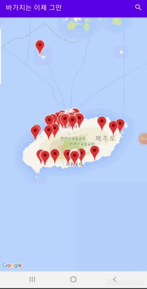
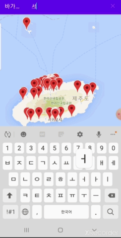
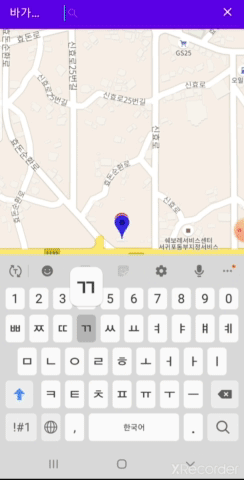
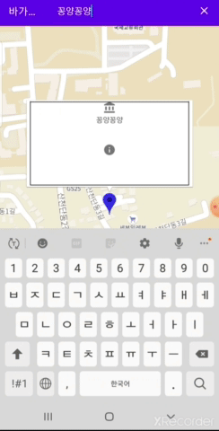

# 바가지는 이제 그만!

## 앱 소개

제주 관광지의 물가가 비싸다고 하는 관광객들에게 현지에 저렴하고 맛있는 식당을 소개하기 위한 앱

## 앱의 기능

앱 화면에 있는 마커를 터치하면 식당의 이름과 대표메뉴가 나옵니다.

마커로 지정된 식당 외의 식당을 검색해 검색한 식당의 위치를 알 수 있습니다.

검색한 식당의 마커를 터치하고 하단에 위치한 길찾기 버튼을 이용하여 식당까지 가는 길을 알 수 있습니다.

## 사용된 오픈소스

- [Google Maps Android API](https://developers.google.com/maps/documentation?hl=ko)

## 참여인원 및 역할
[PM] 김선규 [ksg0605](https://github.com/ksg0605)

- 프로젝트 생성 및 관리
- Google Maps API 추가
- 주소를 위도, 경도로 바꾸기
- 로딩 화면 구현

고은빈 [gongbi00](https://github.com/gongbi00)

- csv파일을 db파일로 변환
- 검색기능 

신호경 [HokoungShin](https://github.com/HokoungShin)

- README.md 작성
